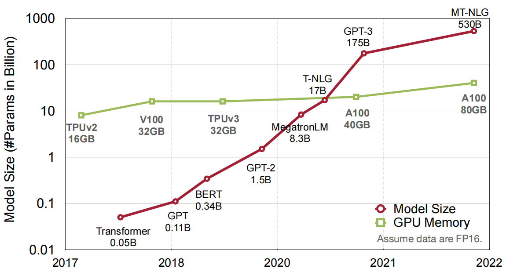

# 第1章 引言

&emsp;&emsp;随着计算性能和存储空间的发展，这使得设备能够运行更大的深度学习模型，有些模型具有数亿，数十亿甚至数百亿的参数，比如常见的7b模型大小，表示70亿的参数量，目前最大的模型参数为4500亿（2024 Snowflake公司的 [Arctic模型](https://www.thepaper.cn/newsDetail_forward_27161326)）。下图是近年来模型大小与GPU发展的趋势，从图中可以看出，GPU硬件发展的速度远远跟不上模型大小的增长速度，这也导致了大模型训练和推理的困难。而模型压缩技术可以弥补这个差距，使得大模型可以在有限的硬件资源上运行。

&emsp;&emsp;在最近的神经网络理论研究中已经发现，神经网络在优化过程中神经元会出现两种冗余情况，部分神经元会“坍缩成”功能类似的神经元，共同负责类似的功能；部分神经元则被忽视，并没有在优化完成后成为某类功能的承担者，这些神经元也被叫做“冗余神经元”。

&emsp;&emsp;根据上述的研究发现，我们可以得到一种等效模型的思想，即将相同功能的神经元用一个神经元等效替代，以及删除掉“冗余神经元”，这些操作并不损害模型本身的性能（甚至在部分情况会有提升），但使得模型的参数量和计算量下降。所以，将模型修剪技术叫做**模型剪枝**。

&emsp;&emsp;类似地，深度学习模型在计算机中通常为[浮点数存储](https://baike.baidu.com/item/%E6%B5%AE%E7%82%B9%E6%95%B0/6162520?fr=ge_ala)，而在具体的计算中，适当减少推理计算的精度并不影响最终的结果，但能减少模型运行的大小，提升计算的速度。把这种针对模型精度处理的技术就叫做**模型量化**。

&emsp;&emsp;除此之外，还有其他的技术如蒸馏学习，神经网络架构搜索等等，也基本上是从模型参数和数值存储的角度出发设计来达到模型减小且保持模型性能的目标。这些技术可以被统称为**模型压缩技术**。这些模型压缩技术有助于解决现代神经网络日益增长的复杂性和资源需求所带来的挑战。通过减小模型大小和提高运行效率，使得模型可以在各种设备上部署深度学习模型，为跨各个领域的实际应用提供可能性。接下来是对涉及的技术大致做一个介绍。

## 1.1 模型剪枝

&emsp;&emsp;模型剪枝主要是从深度学习模型中识别并删除不必要的连接、权重甚至整个神经元。通过消除这些冗余组件，模型可以变得更紧凑、运行更快、内存效率更高，同时剪枝后的模型仍保持较高的准确性。一般建议剪枝从修剪权重开始，因为这不会像修剪神经元那样改变模型的架构。修剪权重的本质是将模型中所选单个参数的权重设置为零，该操作使得改变的参数并不影响模型的推理。

## 1.2 模型量化

&emsp;&emsp;模型量化是另一种通过减少权重和偏差的精度来使神经网络更小、更快、更高效的技术。在传统的深度学习模型中，权重和偏差等参数通常使用32位浮点数（单精度）进行存储和处理，这提供了高精度，但需要大量的内存和计算资源。量化通过使用较少位数（例如8位或甚至更低）表示这些值来降低内容和计算资源的使用。

## 1.3 神经网络架构搜索

&emsp;&emsp;神经网络架构搜索是一种使用机器学习的方法，可以在不需要大量人力的情况下，自动搜索最优网络架构的技术。通过给定搜索空间，如给定模型架构，范围，长度，将模型网络设计转换为搜索问题，通过设计搜索策略和自动化的模型评估方法，自动化快速搜索到给定搜索空间中符合目标的神经网络架构。

## 1.4 知识蒸馏

&emsp;&emsp;知识蒸馏是一种用于将知识从大型复杂模型（通常称为教师模型）转移到较小的简化模型（称为学生模型）的技术。教师模型包含在大型数据集训练过程中学到的大量信息。蒸馏旨在将这些知识提炼成更紧凑、更高效的形式，可以轻松部署在资源受限的设备上或计算能力有限的场景中。

## 1.5 总结

剪枝、量化、神经架构搜索与蒸馏等模型压缩方法为去除模型冗余提供了有效的解决方案。不同的模型压缩方法的特点如下：

| 方法 | 描述 | 适用对象 | 是否要预训练 | 优点 | 缺点 |
|:---:|-----|:---:|:-----------------:|-----|-----|
| 模型剪枝 | 判断参数、通道、滤波、卷积层的显著性，并剪除不重要的部分。|卷积层、全连接层 | 是  |显著减少参数数量，便于在硬件上实现加速。  结构化剪枝使模型变窄，从而减少存储与提高运算速度。| 非结构化剪枝会造成网络结构不规整，难以有效加速。  结构化剪枝可能会造成与硬件平台不兼容，灵活性差。|
| 模型量化 | 基于权值共享、矩阵近似，减少参数及激活值的存储位数，降低内存开销。|卷积层、全连接层 | 是  | 有不错的压缩量和模型性能，训练时间短，可以获得存储量小、计算量低和模型性能好的小型模型。 | 量化后的权重和激活降低了模型的容量和特征图的质量，量化到特殊位置时，容易造成预测精度下降，另外会向梯度信息中引入噪声，导致基于梯度下降法的训练过程收敛难度增加。 |
| 神经网络架构搜索 | 通过搜索算法来探索不同的网络结构，以找到最优的模型配置。|所有层 | 否 |  能够自动化地发现高性能、资源高效的深度学习模型架构。 | 通常需要大量的计算资源和时间，且结果可能受限于搜索空间的定义和搜索算法的选择。 |
| 知识蒸馏 | 将softmax分类器输出作为软知识，作为训练学生模型的先验知识。|卷积层、整个模型 | 是  |  训练简单，可以显著减少参数数量，容易与其他压缩方法组合使用实现更大程度压缩。 | 模型训练时间长，需要训练教师和学生模型；特殊结构很难与卷积核和较小方向的模型结合使用，泛化性差。 |

## 2.常见评估指标

&emsp;&emsp;模型压缩是一种减少深度学习模型大小和计算量的技术，其目的是在保持模型性能的前提下减少资源消耗，使模型更适合部署在资源受限的设备上。模型压缩的常见评估指标包括：

### 2.1 准确率（Accuracy）

&emsp;&emsp;准确率指对比模型压缩前后在特定任务上的准确度，如分类准确率、检测精度等。尽管压缩可能会牺牲一定的精度，但目标是在保持可接受精度的前提下进行压缩。对于LLMs压缩，通常计算在零样本（Zero-shot）数据集上的准确率。

### 2.2 参数量（Params）

&emsp;&emsp;参数量（Params）是指模型中可训练参数的总数，通常是指构成深度学习模型的所有权重（weights）和偏置（biases）的总数。模型大小通常是通过模型的总参数数量来衡量的。一般来说，具有更多参数的模型通常需要更多的计算资源和内存来进行训练和推理。

### 2.3 模型大小（Model Size）

&emsp;&emsp;模型大小（Model Size）是衡量压缩效果最直观的指标，通常以模型文件的存储大小（如MB）来度量。其计算公式为：`大小= 参数量 * 带宽`

&emsp;&emsp;比如一个模型的参数量为70B，假设使用32位浮点数存储，那么其模型大小为：
$$ 70B * 4Bytes(32bits) = 280GB(280 * 10^9 Bytes) $$

### 2.4 乘累加操作（MACs）

&emsp;&emsp;乘累加操作（Multiply-Accumulate Operations，MACs）数量是计算机执行浮点运算的基本单位，包括一个乘法操作和一个累加（加法）浮点数操作。在深度学习中，MACs用于描述卷积神经网络（CNN）中的卷积操作的计算量。具体来说，当我们在卷积层中进行前向传播时，每个卷积核都会与输入特征图（input feature map）的局部区域进行点积（element-wise multiplication），然后将所有点积的结果累加起来，得到输出特征图上的一个值。这个过程中的每一次乘法和随后的累加操作就构成了一个MAC。

### 2.5 浮点运算（FLOPs）

&emsp;&emsp;FLOPs（Number of Floating Point Operations，FLOPs）指模型执行一次前向推理需要的浮点运算次数。FLOPs与模型需要计算资源成正比。浮点运算（FLOPs）是衡量LLMs计算效率的指标，代表LLM执行一个实例所需的浮点运算数量。在模型压缩中，减少 FLOPs 有助于使LLM运行得更快、更高效。 FLOPS（Floating Point Operation Per Second）代表每秒执行的浮点运算次数。

$$FLOPS=\frac{FLOPs}{\text { second }}$$

### 2.6 操作数（OPs）

&emsp;&emsp;神经网络中的激活或权重计算也不总是浮点运算。一般地，操作数（NumberofOperations, OPs）用来测量计算数量。比如：Alex有`724M` MACs，则OPs为：`724M × 2 = 1.4G OPs`。OPS(Operation Per Second)代表每秒执行的操作数。

$$OPS=\frac{OPs}{\text { second }}$$

### 2.6 压缩比（Compression Ratio）

&emsp;&emsp;压缩比是原始模型大小与压缩后模型大小的比值。比率越高意味着大小减少得越多，显示压缩在节省存储和内存方面的有效性。更高的压缩比意味着更小的模型大小，但也可能伴随性能损失。

### 2.7 推理时间（Inference Time）

&emsp;&emsp;推理时间是指模型在推理过程中处理输入数据并生成响应所花费的时间。模型压缩通常会提高推理速度，因为它减少了计算量和模型大小。推理时间对于LLM需要响应用户查询或实时处理大量数据的实际应用程序尤其重要。

### 2.8 吞吐量（Throughput）

&emsp;&emsp;吞吐量（Throughput）是指模型在单位时间内能够处理的数据量，通常用于衡量压缩后模型的效率。Throughput 通常是与其他性能指标（如准确率、延迟）一同考量，以平衡模型精度和推理速度之间的关系。在剪枝或量化时，如果模型的 Throughput 提升显著而精度损失较小，则该压缩方法是有效的。

## 引用资料
-  [全球最大开源模型再刷爆纪录，4800亿参数MoE击败Llama 3、Mixtral](https://www.thepaper.cn/newsDetail_forward_27161326)
- [浮点数介绍](https://baike.baidu.com/item/%E6%B5%AE%E7%82%B9%E6%95%B0/6162520?fr=ge_ala)
- [模型压缩综述](https://arxiv.org/pdf/2308.07633v4)
