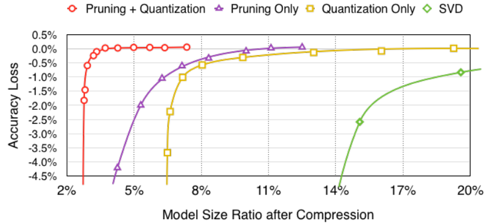

# 第7章 项目实践

<!-- 本章节将通过一个综合类的项目实践融入前面介绍的模型压缩方法帮助学习者更好的理解 -->

&emsp;&emsp;本教程中提到的模型压缩算法，剪枝、量化、蒸馏、神经网络架构搜索，在实际应用中相互垂直，各有自己适用的场景和取舍。然而我们可以将多种模型压缩算法进行结合，以达到更好的效果。

&emsp;&emsp;目前，效果较好，研究与应用较为丰富的模型压缩算法的结合运用主要有：
- 剪枝与量化结合
- 知识蒸馏与量化结合
- 剪枝与知识蒸馏结合
- 神经架构搜索与知识蒸馏结合

&emsp;&emsp;另外，最近的一些研究中也提出了一些更加综合的模型压缩算法的结合方法，比如：
- 知识蒸馏与剪枝，量化结合
- 神经网络架构搜索与剪枝，量化结合

&emsp;&emsp;本教程将结合实际中的应用，对于常见的图像分类任务，通过对ResNet-18模型应用不同的压缩方法，并从硬件效率提升，模型能力保留(考虑实现难度，主要基于CIFAR-10数据集)，与算法实现难度的角度进行对比

<!-- 另外，提供cpu-only和cuda的两个版本的代码？ -->

<!-- TODO: 增加LLM模型压缩实践部分？ -->

## 7.1 剪枝与量化结合

&emsp;&emsp;剪枝和量化都可以很好地减少模型权重和激活值中的冗余，从而减少模型的大小和计算量。因为二者都可以在后训练阶段进行，并且相对来说需要的计算资源可以较少，是模型压缩结合的热门方向。Song Han et.al (2016)在论文[Deep Compression: Compressing Deep Neural Networks with Pruning, Trained Quantization and Huffman Coding](https://arxiv.org/abs/1510.00149)中的实验中表明，比起单独的剪枝或量化，将剪枝与量化结合，可以高压缩率时更好地保持模型的准确度：

&emsp;&emsp;前面的章节提到：

>剪枝（从时机上）可以分为：
> - 训练后剪枝 （静态稀疏性）
> - 训练时剪枝 （动态稀疏性）
> - 训练前剪枝

>而量化主要分为：
> - 训练后量化 PTQ
> - 量化感知训练 QAT

&emsp;&emsp;对于部署和压缩加速已有的预训练模型，在时间和计算资源相对有限时，常用的解决方案是将训练后剪枝和训练后量化结合。

### 7.1.1 初步尝试（简单组合）
&emsp;&emsp;简单直觉上来说，剪枝和量化结合的方法可以有：
&emsp;&emsp;**先剪枝，再量化**：首先对模型进行剪枝，然后对剪枝后的模型进行量化。
&emsp;&emsp;**先量化，再剪枝**：首先对模型进行量化，然后对量化后的模型进行剪枝。

&emsp;&emsp;然而，对于这样简单的拼凑，会出现一系列问题：
对于**先剪枝，再量化**
- 剪枝之后的模型减少了信息的通道数，导致模型的鲁棒性降低，因而对量化引入的噪声的容忍度降低，导致量化后的模型性能下降。
- 剪通常将权重设置为零，从而产生稀疏性。但是，量化可能使这些零值映射到非零量化值，从而降低稀疏性。尤其是如果量化中进行了微调在剪枝后进行量化感知训练（QAT），在训练过程中（如果没有特殊处理）也会将这些一些零值调整到非零值，从而降低稀疏性。

对于**先量化，再剪枝**
- 量化把原来的连续值映射到离散值，而对离散值进行剪枝会更加不精确（因为权重所有可能取值的总数大大减小），效果可能会降低。
- 由于量化过后的神经网络更难进行反向传播，而性能较好的剪枝方法（迭代剪枝等）几乎离不开再训练（微调，倒带...）。

&emsp;&emsp;因此，我们需要对剪枝和量化的结合进行更深入的研究，以解决这些问题。

### 7.1.2 问题分析与解决

**相关文献：**

Frederick Tung & Greg Mori（2018）在论文[CLIP-Q: Deep Network Compression Learning by In-Parallel Pruning-Quantization](https://doi.org/10.1109/cvpr.2018.00821)中提出将剪枝和量化结合在一个学习框架（贝叶斯优化）中，通过分区将剪枝与量化结合进行，并行微调。（文中剪枝采用非结构化剪枝，更关心模型大小。文中量化并非直接量化到整数，而是取分区间隔的均值）

Shaokai Ye et.al (2018) 在论文[A Unified Framework of DNN Weight Pruning and Weight Clustering/Quantization Using ADMM](https://arxiv.org/abs/1811.01907)中提出了基于ADMM的权重修剪和聚类/量化的统一框架，利用交替方向乘子法（ADMM），将最小化模型误差的非凸优化问题，转换为最小化权重改变带来的误差和偏置改变带来的误差的子问题，并进行有效求解。

Haichuan Yang et.al (2020) 在论文[Automatic Neural Network Compression by Sparsity-Quantization Joint Learning: A Constrained Optimization-based Approach](https://arxiv.org/abs/1910.05897)中，在使用ADMM统一剪枝量化的基础之上提出了一种可以根据目标模型大小自动对DNN进行联合修剪和量化，而无需使用任何超参数来手动设置每层的压缩比的方法。

Mart van Baalen et.al (2020) 在论文[Bayesian Bits: Unifying Quantization and Pruning](https://arxiv.org/abs/2005.07093)中提出了一种基于梯度优化的剪枝与混合精度量化的方法，将量化问题分解成一系列的位宽加倍问题。在每个新的位宽处，全精度值与先前舍入值之间的残差将被量化。然后决定是否将此量化残差相加，以获得更高的有效位宽和更低的量化噪声。因为从 2 的幂位宽开始，这种分解将始终产生硬件友好的配置，并通过额外的 0 位选项，用作剪枝和量化的统一框架。

Gil Shomron et.al (2021) 在论文[Post-Training Sparsity-Aware Quantization](https://arxiv.org/abs/2105.11010)中提出了对剪枝后的模型进行高效量化的方法，首先跳过零值将权重和激活量化到8位，然后分析成对的激活值中是否有零，有则保留8位，如果没有则都量化到4位，从而实现了轻微的精度下降和实用的硬件表现。（文中剪枝主要为非结构化，动态稀疏）

Shipeng Bai et.al (2023) 在论文[Unified Data-Free Compression: Pruning and Quantization without Fine-Tuning](https://arxiv.org/abs/2308.07209)中提出了一种名为统一无数据压缩（UDFC）的新框架，可以同时执行修剪和量化，而无需任何数据和微调过程。首先假设损坏（例如，修剪或量化）信道的部分信息可以通过其他信道的线性组合来保留，然后从恢复压缩导致的信息丢失的假设中推导出重构形式。最后，我们制定了原始网络与其压缩网络之间的重构误差，并从理论上推导了闭合形式的解。

&emsp;&emsp;

## 7.2 知识蒸馏与量化结合

<!-- FracBits [5] used differentiable neural architecture search (NAS) with hardware costs to fine-tune quantization. -->